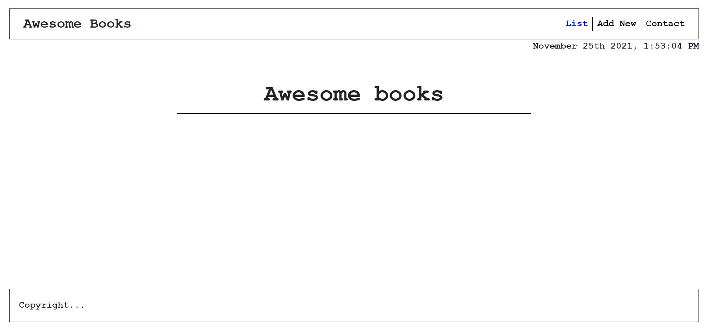

# Awesome books

> This prject you can add books, display them and remove the ones you don't want.

## Built With

- JavaScript 
- HTML
- CSS
- Bootstrap

## Live Demo

[Live Demo Link](https://shadyshawkat.github.io/awesome-books/)

## Getting Started

To get a local copy up and running follow these simple example steps.

1- Navigate to the button on the top right green "code" button.

2- In the drop down menu choose "Download Zip".

3- After extracting the files, you'll have my project on your local machine.

## Authors

👤 **Shady Shawkat**

- GitHub: [@ShadyShawkat](https://github.com/ShadyShawkat)

👤 **Ayebazibwe Ishmael**

- GitHub: [@ayebaishmo](https://github.com/ayebaishmo)

👤 **Angela Cuahutle**

- GitHub: [@angelacuahutle](https://github.com/angelacuahutle)

## 🤝 Contributing

Contributions, issues, and feature requests are welcome!

Feel free to check the [issues page](../../issues/).

## Show your support

Give a ⭐️ if you like this project!

## Acknowledgments

- Hat tip to anyone whose code was used
- Inspiration
- etc

## 📝 License

This project is [MIT](./MIT.md) licensed.
